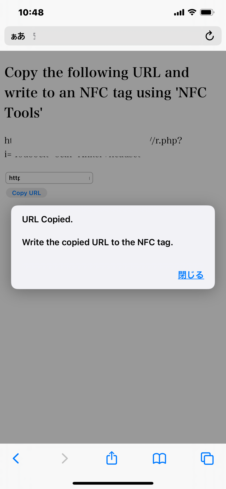
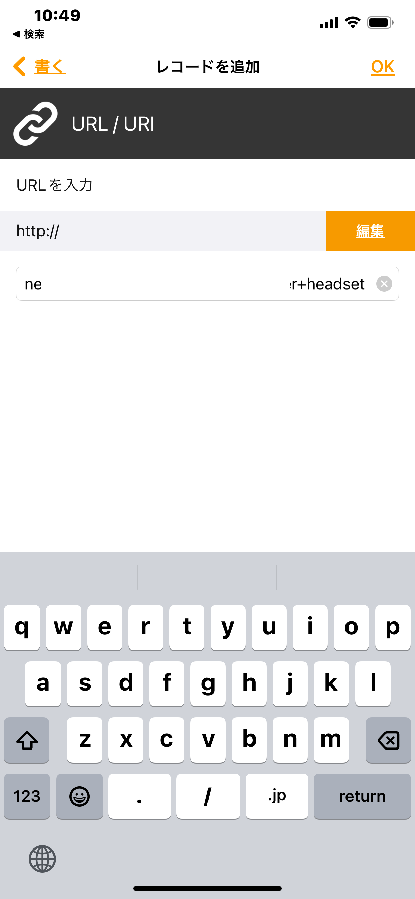
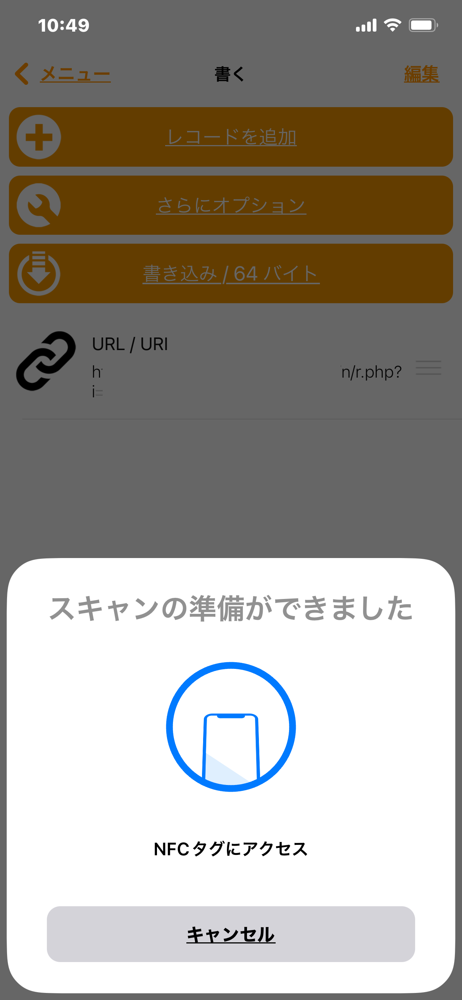
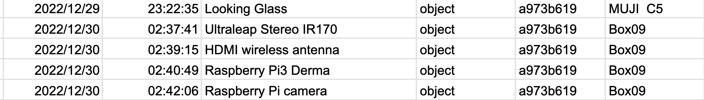

# NFCinventory
Tool to manage the location of things with NFC and smartphone

NFC タグをつかった、物品の位置管理システムです。

## 特徴

* 物品や場所の登録にはスマートフォンアプリ `NFC Tools`など、URLをNFCタグに書き込むアプリを使う。登録以外には特別なアプリは不要。
* いったん登録してしまえば、場所のタグ、物品のタグ、の順にスマートフォンでタッチするだけで、物品の位置が自動更新される。
* 物品の位置はGoogle Spread Sheetから閲覧可能


## 利用環境：

* NFC対応のスマートフォン(iPhone・Android等)
* NFCタグ（書き込み可能なもの）
* PHPが稼働するwebサーバー
* NFCタグ書き込み用のスマートフォンアプリ(`NFC Tools` 等)

# 使い方

「インストール」を参照してサーバー環境が設定されているものとする。

## 1. 利用するタグ

NFCタグ（シール型、キーチェイン型など）を用意する。


## 2. NFCタグへの情報登録

スマートフォンで　**「登録用サイト」** (`https://<base_url>/n/reg.html` 等。実際は使用しているwebサーバーのURL)をオープンすると、次のような画面になる。


オブジェクト名 (Object Name) を入力し、物品の種類（Object, Box, Place) を指定しする。

* Object は位置を管理したい物品
* Box はobjectを格納できる箱など（Boxの場所は移動可能とする）
* Place は棚など、位置が移動できない場所

「Registration」ボタンを押す。URLが表示されるので、「Copy URL」 ボタンを押して、生成されたURLをクリップボードにコピーする。



次に、アプリの<strong>NFC Tools</strong>を立ち上げる。


NFC Tools (iOS, Android):
* https://apps.apple.com/us/app/nfc-tools/id1252962749
* https://play.google.com/store/apps/details?id=com.wakdev.wdnfc&hl=en&gl=US


書く＞レコードを追加＞URL/URI を選択し、先程コピーしたURLを設定する（すでに何かが書き込まれたNFCタグの場合は、最初にメモリを消去しておく）：



URLが設定できたら、「書き込み」ボタンを押すと、NFCタグ書き込みモードになるので、NFCタグの上にスマートフォンを載せてURLを書き込む（iPhoneの場合、スマートフォンの上辺のすぐ下あたりにタグを置くとよい）。



タグへの書き込みが成功したら、物品にタグを貼り付ける（キーチェーンの場合は物品にとりつける）。場所(place)のタグの場合は、その場所にタグを貼り付ける。

以上で登録は終了。このようにして、物品(object), 箱(box), 場所(place)にタグを登録していく。

## 3. 位置の登録

物品の場所を登録する場合は、まず場所(place)のタグをタッチし、出てくるURLを開く。続いて、物品(object)のタグをタッチし、出てくるURLをを開くと、その物品と場所が関係づけられる。


物品の位置は、Object List google spreadsheet でも確認できる：



---

# インストール

## 1. PHPが動作可能なWebサーバーに、htmlサブディレクトリ以下をコピーする。

`html/n/reg.html` が、 `https://<base_url>/n/reg.html` でアクセスできるとする。これが<strong>「登録用サイト」</strong> になる。

## 2. <strong>composer</strong> でGoogle PHP API clientを導入 (html/n のディレクトリで以下を実行）：
```
$ cd html/n
$ composer require google/apiclient:"^2.0"
```

参照:
* https://bashalog.c-brains.jp/19/04/12-101500.php
* https://github.com/googleapis/google-api-php-client
* https://qiita.com/yukachin0414/items/bb2f54f59564919be6c7
 

## 3. Google spreadsheet用の認証ファイルを　`credential.json` として `html/n` と同じ場所に置く。 

認証ファイルの生成方法は以下を参照：

* https://bashalog.c-brains.jp/19/04/12-101500.php
* https://blog.capilano-fw.com/?p=1816

以上が終了すると、`html/n`には以下のようにファイルが生成されているはず：
```
action.php		credentials.json	settings.php
common.php		init.php		vendor
composer.json		r.php
composer.lock		reg.html
```

## 4. Google Spread Sheet を作成する。

`credential.json`の中の`client_emai` のemailからアクセス（編集）できるように共有設定する。

## 5. Spered Sheet IDをsetting.php に設定

`https://docs.google.com/spreadsheets/d/xxxxxxxxxx/edit#gid=0`

の`xxxxxxxxxx`の部分がSpread Sheet ID。

これを、html/n/settings.php の `$sheet_id` の定義の部分に転記する。また、`$base_url`も、実際のWebサーバーのアドレスに変更する：

```php
$sheet_id = "<Google spreadsheet ID>";
$base_url = 'https://<base_url>/n';
```
## 6. init.php を実行してスプレッドシートを初期設定

`https://<base_url>/init.php` を実行すると、それぞれのスプレッドシートにヘッダが設定される（エラーになる場合は `settings.php`, `crediential.json` の内容を確認）。

## Local Server

Webサーバーを立てることが難しい場合には、LAN内にphpによるhttpdサーバーを起動することができる：

```
$ cd html  
$ sudo php -S <IP_address>:80
```

で、　`http://<IP_address>:80/n/reg.html` 等にアクセスできるようになる。


