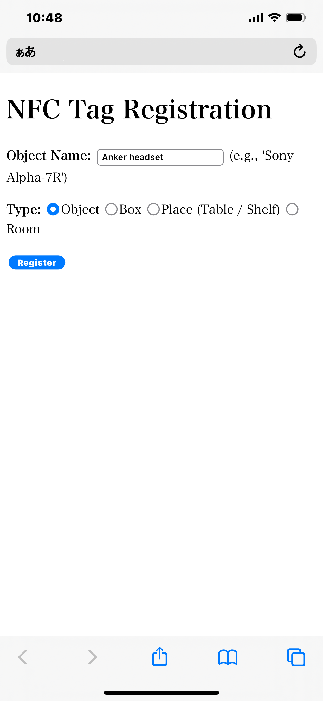

# NFCinventory
Tool to manage the location of things with NFC and smartphone

NFC タグをつかった、物品の位置管理システムです。

## 特徴

* 物品や場所の登録にはスマートフォンアプリ NFC Toolsなど、URLをNFCタグに書き込むアプリを使う。登録以外には特別なアプリは不要。

* いったん登録してしまえば、場所のタグ、物品のタグ、の順にスマートフォンでタッチするだけで、物品の位置が自動更新される。

* 物品の位置はGoogle Spread Sheetからも閲覧可能

## 利用環境：

* NFC対応のスマートフォン(iPhone等)
* NFCタグ（書き込み可能なもの）
* PHPが稼働するwebサーバー
* NFCタグ書き込み用のスマートフォンアプリ(NFC Tools 等)

# 使い方
## 物品、箱、場所の登録

NFCタグ（シール型、キーチェイン型など）を用意する。

スマートフォンで　<strong>「登録用サイト」</strong> をオープンすると、次のような画面になる。

オブジェクト名 (Object Name) を入力し、物品の種類（Object, Box, Place) を指定しする。

* Object は位置を管理した物品
* Box はobjectを格納できる箱等（場所は移動可能）
* Place は棚など、位置が移動できない場所

Registration を押す。URLが表示されるので、Copy URL ボタンを押して、生成されたURLをクリップボードにコピーする。

次に、アプリのNFC Toolsを立ち上げる。書き込み＞レコードを追加＞URL/URI を選択し、先程コピーしたURLを設定する（すでに何かが書き込まれたNFCタグの場合は、最初にメモリを消去しておく）：

URLが設定できたら、「書き込み」ボタンを押すと、NFCタグ書き込みモードになるので、NFCタグの上にスマートフォンを載せてURLを書き込む（iPhoneの場合、スマートフォンの上辺のすぐ下あたりにタグを置くとよい）。

タグへの書き込みが成功したら、物品にタグを貼り付ける（キーチェーンの場合は物品にとりつける）。場所(place)のタグの場合は、その場所にタグを貼り付ける。

以上で登録は終了。このようにして、物品(object), 箱(box), 場所(place)にタグを登録していく。

## 位置の登録

物品の場所を登録する場合は、まず場所(place)のタグをタッチし、出てくるURLを開く。続いて、物品(object)のタグをタッチし、出てくるURLをを開くと、その物品と場所が関係づけられる。

物品の位置は、Object List google spreadsheet でも確認できる：

# インストール

PHPが動作可能なWebサーバーに、htmlサブディレクトリ以下をコピーする。

html/r/reg.html が、 `http://aaa.bbb.ne.jp/n/reg.html` でアクセスできるとする。これが<strong>「登録用サイト」</strong> になる。

Google spreadsheet用の認証ファイルを　`credential.json` として `html/r` と同じ場所に置く。

